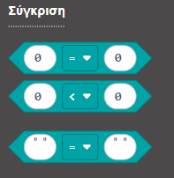
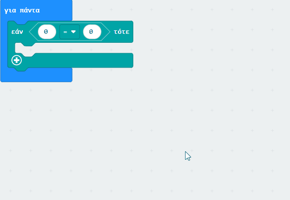
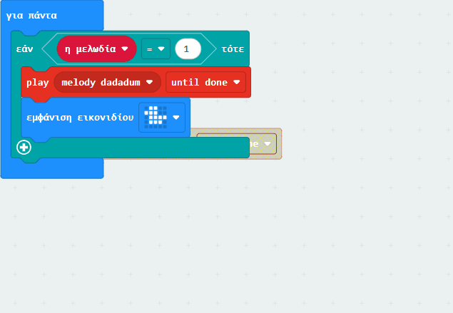

Μπορεί να υπάρχουν φορές που θέλεις ένα συγκεκριμένο μέρος του προγράμματός σου να εκτελείται **μόνο** όταν εκπληρωθεί μια συγκεκριμένη συνθήκη. Στον προγραμματισμό, αυτό ονομάζεται **επιλογή**.

Στο MakeCode, το πιο σημαντικό μπλοκ που θα χρησιμοποιήσεις για επιλογή είναι το μπλοκ `εάν`{:class='microbitlogic'}.

### Χρησιμοποιώντας ένα μπλοκ εάν

Θα βρεις το μπλοκ `εάν`{:class='microbitlogic'} στο μενού `Λογική`{:class='microbitlogic'}.

Πρέπει να τοποθετήσεις τα μπλοκ `εάν`{:class='microbitlogic'} μέσα σε άλλα μπλοκ, όπως βρόχους `για πάντα`{:class='microbitbasic'} ή ένα μπλοκ `όταν πιεστεί το πλήκτρο`{:class='microbitinput'}.

Μπορείτε να τοποθετήσετε άλλα μπλοκ **μέσα** σε ένα μπλοκ `if`{:class='microbitlogic'} και αυτά θα εκτελεστούν μόνο **εάν** η συνθήκη είναι `αληθής`.

### Η συνθήκη

Ένα σημαντικό μέρος του μπλοκ `εάν`{:class='microbitlogic'} είναι η **συνθήκη**. Τα μπλοκ μέσα σε ένα `εάν`{:class='microbitlogic'} θα εκτελούνται μόνο εάν μια συνθήκη είναι `αληθής`.

Μπορείς να βρεις τα μπλοκ συνθήκης στο μενού `Λογική`{:class='microbitlogic'} της Εργαλειοθήκης.

Μια συνθήκη έχει δύο μέρη:

1. Δεδομένα
2. Έναν τελεστή

**Δεδομένα**

Πρέπει να υπάρχουν δεδομένα και από τις δύο πλευρές της συνθήκης σου. Αυτό μπορεί να είναι μια μεταβλητή, μια ένδειξη αισθητήρα, ένα `αληθές/ψευδές` ή ένας αριθμός.

**Τελεστής**

Οι τελεστές είναι **πώς** συγκρίνεις τα δύο τμήματα των δεδομένων.

Μπορείς να σκεφτείς τον τελεστή σαν μια ερώτηση που ρωτάς για τα δύο τμηματα των δεδομένα σου (τελεστέοι).

Οι τελεστές που μπορείς να χρησιμοποιήσεις είναι:

- `=` — είναι οι δύο τελεστέοι**ίσοι**;
- `≠` — οι δύο τελεστέοι **δεν είναι ίσοι**;
- `>` — είναι το πρώτο τμήμα δεδομένων **μεγαλύτερο από** το δεύτερο;
- `<` — είναι το πρώτο τμήμα δεδομένων **μικρότερο από** το δεύτερο;
- `≥` — είναι το πρώτο τμήμα δεδομένων **μεγαλύτερο ή ίσο** με το δεύτερο;
- `≤` — είναι το πρώτο τμήμα δεδομένων **μικρότερο ή ίσο** με το δεύτερο;

Μπορείς να επιλέξεις έναν τελεστή σύροντας ένα μπλοκ σύγκρισης στο μπλοκ `εάν`{:class='microbitlogic'} και κάνοντας κλικ στο αναπτυσσόμενο μενού.

#### αλλιώς εάν και αλλιώς

Μπορείς επίσης να προσθέσεις περισσότερα πιθανά αποτελέσματα στο μπλοκ `εάν`{:class='microbitlogic'} με τα μπλοκ `αλλιώς`{:class='microbitlogic'} και `αλλιώς εάν`{:class='microbitlogic'}.

**αλλιώς**

Μερικές φορές μπορεί να χρειαστεί να εκτελεστεί κάποιος κώδικας εάν η συνθήκη στο μπλοκ `εάν`{:class='microbitlogic'} είναι `ψευδής`. Για να το κάνεις αυτό, μπορείς να χρησιμοποιήσεις μια συνάρτηση `αλλιώς`{:class='microbitlogic'}.

Τα μπλοκ μέσα σε ένα `εάν`{:class='microbitlogic'} θα εκτελούνται μόνο εάν μια συνθήκη είναι `αληθής`.

Για να προσθέσεις ένα `αλλιώς`{:class='microbitlogic'}, πρέπει να κάνεις κλικ στο σύμβολο `+` στο κάτω μέρος του μπλοκ `εάν`{:class='microbitlogic'}.

Υπάρχει επίσης ένα μπλοκ `if else`{:class='microbitlogic'} που μπορείς να χρησιμοποιήσεις αν γνωρίζεις ότι θα χρειαστεί να κάνεις ένα πράγμα αν μια συνθήκη είναι αληθής και ένα άλλο αν μια συνθήκη είναι ψευδής.

**αλλιώς εάν**

Ένα μπλοκ `αλλιώς εάν`{:class='microbitlogic'} σου επιτρέπει να προσθέσεις μια άλλη συνθήκη για έλεγχο.

Θα ελέγξει τη δεύτερη συνθήκη μόνο εάν η πρώτη συνθήκη είναι `ψευδής`. Αν θέλεις να ελέγχονται πάντα και οι δύο συνθήκες, πρέπει να προσθέσεις ένα δεύτερο μπλοκ `εάν`{:class='microbitlogic'}.\*\*

Για να προσθέσεις ένα μπλοκ `αλλιώς εάν`{:class='microbitlogic'}, πρέπει να κάνεις κλικ στο σύμβολο `+` στο κάτω μέρος του μπλοκ `εάν`{:class='microbitlogic'}.

Αν θέλεις απλώς ένα `αλλιώς εάν`{:class='microbitlogic'}, θα πρέπει να κάνεις κλικ στο `+` δύο φορές και στη συνέχεια στο `-` στο `αλλιώς`{:class='microbitlogic'}.

Στη συνέχεια, θα πρέπει να προσθέσεις μια άλλη `συνθήκη`.
