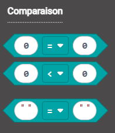
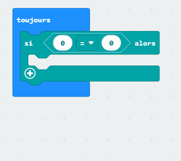
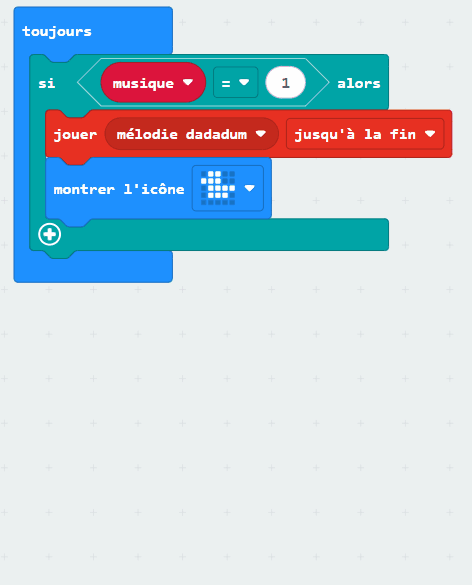

Il peut arriver que tu souhaites qu'une partie spécifique de ton programme s'exécute **uniquement** lorsqu'une certaine condition est remplie. En programmation, cela s'appelle **sélection**.

Dans MakeCode, le bloc le plus important que tu utiliseras pour la sélection est le bloc `si`{:class='microbitlogic'}.

### Utilisation d'un bloc si

Tu trouveras le bloc `si`{:class='microbitlogic'} dans le menu `Logique`{:class='microbitlogic'}.

Tu dois mettre des blocs `si`{:class='microbitlogic'} à l'intérieur d'autres blocs, comme les boucles `toujours`{:class='microbitbasic'} ou un bloc `lorsque le bouton est pressé`{:class='microbitinput'}.

Tu peux placer d'autres blocs **à l'intérieur** d'un bloc `si`{:class='microbitlogic'}, et ils ne s'exécuteront que **si** la condition est `vraie`.

### La condition

Une partie importante du bloc `si`{:class='microbitlogic'} est la **condition**. Les blocs à l'intérieur d'un `si`{:class='microbitlogic'} ne s'exécuteront que si une condition est `vraie`.

Tu peux trouver les blocs de conditions dans le menu `Logique`{:class='microbitlogic'} de la boîte à outils.

 0, and a string comparison block." width="300"/>

Une condition comporte deux parties :

1. Données
2. Un opérateur

**Données**

Il doit y avoir des données de chaque côté de ta condition. Cela peut être une variable, une lecture de capteur, un `vrai/faux` ou un nombre.

**Opérateur**

Les opérateurs sont la **façon dont** tu compares les deux éléments de données.

Tu peux voir ça comme une question que tu poses sur tes deux éléments de données.

Les opérateurs que tu peux utiliser sont :

- `=` — les deux côtés sont-ils **égaux** ?
- `≠` — les deux côtés ne sont-ils **pas égaux** ?
- `>` — la première donnée est-elle **supérieure** à la deuxième ?
- `<` — la première donnée est-elle **inférieure** à la deuxième ?
- `≥` — la première donnée est-elle **supérieure ou égale** à la deuxième ?
- `≤` — la première donnée est-elle **inférieure ou égale** à la deuxième ?

Tu peux choisir un opérateur en faisant glisser un bloc de comparaison dans ton bloc `si`{:class='microbitlogic'} et en cliquant sur le menu déroulant.

#### sinon si et sinon

Tu peux également ajouter plus de résultats possibles à ton bloc `si`{:class='microbitlogic'} avec les blocs `sinon`{:class='microbitlogic'} et `sinon si`{:class='microbitlogic'}.

**sinon**

Parfois, tu souhaites peut-être que du code s'exécute si la condition dans ton bloc `si`{:class='microbitlogic'} est `faux`. Pour cela, tu peux utiliser un `sinon`{:class='microbitlogic'}.

Les blocs à l'intérieur de la partie `sinon`{:class='microbitlogic'} s'exécuteront **seulement** lorsque la condition est `fausse`.

Pour ajouter un `sinon`{:class='microbitlogic'}, tu dois cliquer sur le symbole `+` en bas de ton bloc `si`{:class='microbitlogic'}.

Il y a aussi un bloc `si sinon`{:class='microbitlogic'} que tu peux utiliser si tu sais que tu devras faire une chose si une condition est vraie et une autre si une condition est fausse.

**sinon si**

Un bloc `sinon si`{:class='microbitlogic'} te permet d'ajouter une autre condition à vérifier.

**Il ne vérifiera la deuxième condition que si la première condition est `fausse`. Si tu souhaites que les deux conditions soient toujours vérifiées, tu dois ajouter un deuxième bloc `si`{:class='microbitlogic'}.**

Pour ajouter un bloc `sinon si`{:class='microbitlogic'}, cliques sur le symbole `+` en bas du bloc `si`{:class='microbitlogic'}.

Si tu veux juste un `sinon si`{:class='microbitlogic'}, tu devras cliquer deux fois sur le `+` puis sur le `-` le `sinon`{:class='microbitlogic'}.

Tu devras ensuite ajouter une autre `condition`.
