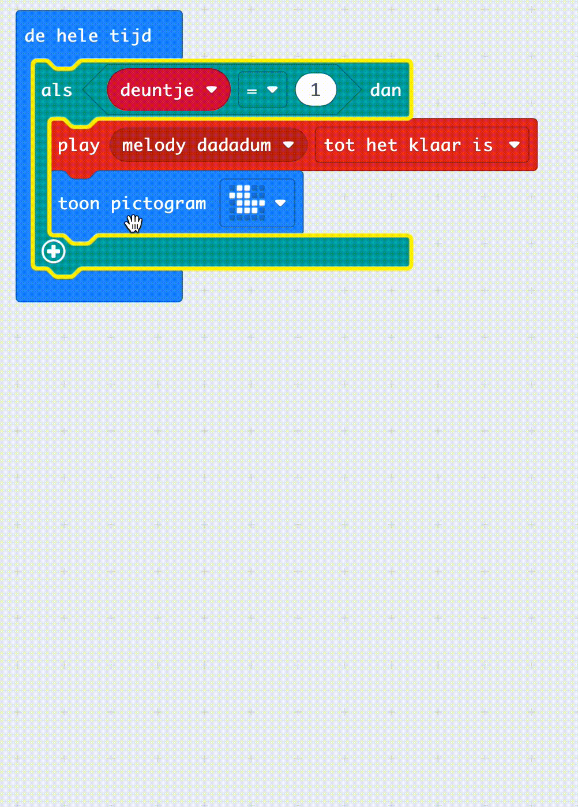

Het kan voorkomen dat je wilt dat een specifiek onderdeel van jouw programma **alleen** wordt uitgevoerd als aan een bepaalde voorwaarde is voldaan. In programmeren heet dit **selectie**.

In MakeCode is het belangrijkste blok dat je voor selectie gebruikt het `als`{:class='microbitlogic'} blok.

### Een als blok gebruiken

Je vindt het blok `als`{:class='microbitlogic'} in het menu `Logisch`{:class='microbitlogic'}.

Je moet `als`{:class='microbitlogic'} blokken in andere blokken zetten, zoals `de hele tijd`{:class='microbitbasic'} lussen of een `wanneer knop wordt ingedrukt`{:class='microbitinput'} blok.

Je kunt andere blokken **binnen** een `als`{:class='microbitlogic'} blok plaatsen en ze zullen alleen werken **als** de voorwaarde `waar` is.

### De voorwaarde

Een belangrijk deel van het `als`{:class='microbitlogic'} blok is de **voorwaarde**. De blokken in een `als`{:class='microbitlogic'} blok worden alleen uitgevoerd als een voorwaarde `waar` is.

Je kunt de voorwaarden blokken vinden in het menu `Logisch`{:class='microbitlogic'} van de Toolbox.

 0, and a string comparison block." width="300"/>

Een voorwaarde bestaat uit twee delen:

1. Gegevens
2. Een operator

**Gegevens**

Er moeten gegevens aan beide kanten van je voorwaarde staan. Dit kan een variabele, een uitlezing van een sensor zijn, een `waar/onwaar`, of een getal.

**Operator**

De operators bepalen **hoe** je de twee stukken gegevens met elkaar vergelijkt.

Je kunt de operator beschouwen als een vraag die je stelt over je twee gegevens.

De operators die je kan gebruiken zijn:

- `=` - zijn de twee zijden **gelijk**?
- `≠` — zijn de twee zijden **niet gelijk**?
- `>` — is het eerste stukje gegevens **groter dan** het tweede?
- `<` — is het eerste stukje gegevens **kleiner dan** het tweede?
- `≥` — is het eerste stukje gegevens **groter dan of gelijk aan** het tweede?
- `≤` — is het eerste stukje gegevens **kleiner dan of gelijk aan** het tweede?

Je kunt een operator kiezen door een vergelijkingsblok in je 'als' {:class='microbitlogic'} blok te slepen en op het vervolgkeuzemenu te klikken.

#### anders als en anders

Je kunt nog meer mogelijke resultaten toevoegen aan je `als`{:class='microbitlogic'} blok met `anders`{:class='microbitlogic'} en `anders als`{:class='microbitlogic'} blokken.

**anders**

Soms wil je dat wat code wordt uitgevoerd als de voorwaarde in je `als`{:class='microbitlogic'} blok `onwaar` is. Om dit te doen, kun je een `anders`{:class='microbitlogic'} blok gebruiken.

De blokken in een `anders`{:class='microbitlogic'} blok worden alleen uitgevoerd als een voorwaarde `onwaar` is.

Om een `anders`{:class='microbitlogic'} toe te voegen, moet je op het `+` symbool onder in je `als`{:class='microbitlogic'} blok klikken.

Er is ook een `als anders`{:class='microbitlogic'} blok dat je kunt gebruiken als je weet dat je één ding moet doen als een voorwaarde waar is en een ander als een voorwaarde niet waar is.

**anders als**

Een `anders als`{:class='microbitlogic'} blok stelt je in staat een andere voorwaarde toe te voegen om te controleren.

**Het zal alleen de tweede voorwaarde controleren als de eerste voorwaarde `onwaar` is. Als je altijd wilt dat beide voorwaarden worden gecontroleerd, moet je een tweede `als`{:class='microbitlogic'} blok toevoegen.**

Om een `anders als`{:class='microbitlogic'} blok toe te voegen, klik je op het `+` symbool onderaan het `als`{:class='microbitlogic'} blok.

Als je alleen een `anders als`{:class='microbitlogic'} wilt, zul je twee keer op de `+` moeten klikken en vervolgens op de `-` van de `anders`{:class='microbitlogic'}.

Je moet dan nog een `voorwaarde` toevoegen.
